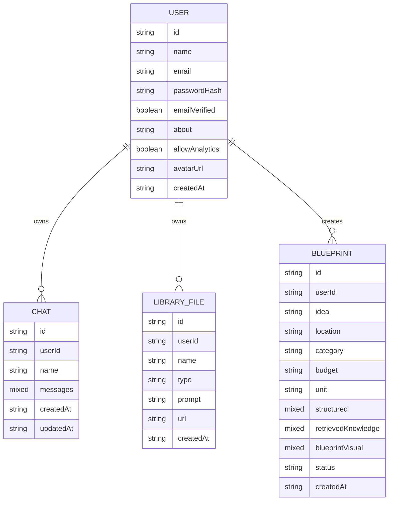
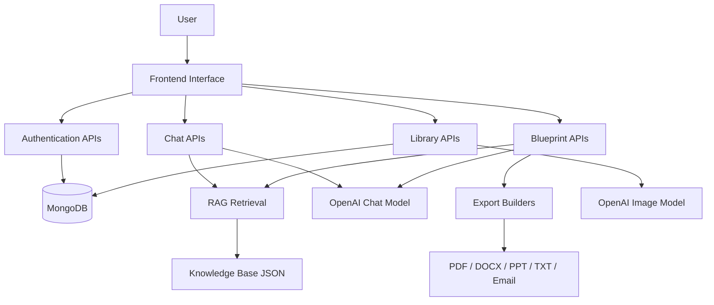
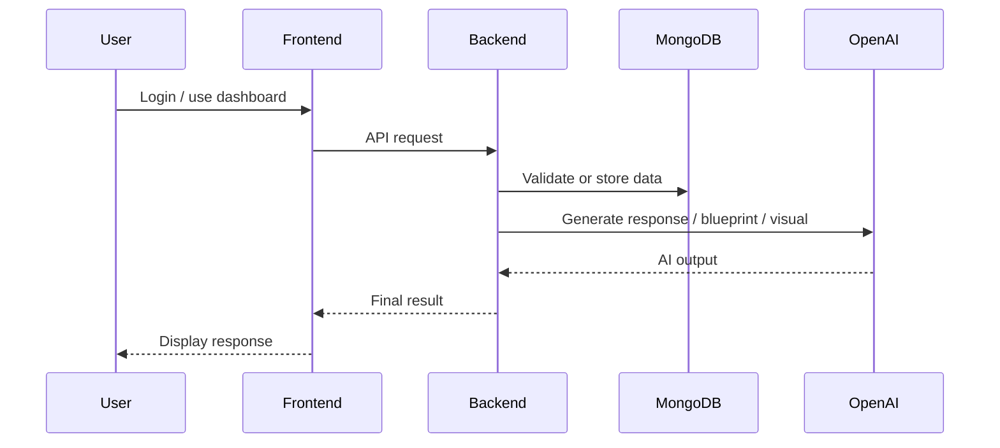

# StartGenie AI Review PPT Content

## Slide 1: Title Slide

**Project Title:** StartGenie AI  
**Review Focus:** Review 3 - Implementation and Review 4 - Testing and Result Analysis  
**Project Type:** Full-Stack AI-Based Startup Assistance Platform  
**Technologies:** React, Vite, Node.js, Express.js, MongoDB, OpenAI APIs

## Slide 2: Project Overview

- StartGenie AI helps users convert startup ideas into structured business blueprints.
- The platform combines authentication, AI chat, RAG-based guidance, blueprint generation, visual generation, and export.
- It is designed for students, early founders, and academic project demonstration.

## Slide 3: Detailed Study of Algorithms / Model / Hardware Specification

### Algorithms and Models Used

- **Authentication Algorithm**
  - user credentials are validated
  - password is hashed using `bcryptjs`
  - JWT token is generated after successful authentication

- **AI Chat Response Workflow**
  - user enters startup query
  - previous chat context is collected
  - relevant knowledge chunks are retrieved using embeddings
  - OpenAI chat model generates a focused response

- **RAG Retrieval Workflow**
  - query is embedded using `text-embedding-3-small`
  - similarity is calculated against stored knowledge vectors
  - top-ranked chunks are inserted into the generation prompt

- **Blueprint Generation Workflow**
  - startup inputs are validated
  - optional clarifying answers are added
  - structured JSON blueprint is generated using OpenAI
  - blueprint is stored and can be exported

### Hardware Specification

- Processor: Intel i3 / Ryzen 3 or higher
- RAM: Minimum 4 GB, recommended 8 GB
- Storage: At least 1 GB free disk space
- Internet: Required for OpenAI API-based generation

## Slide 4: Confirmation of Dataset Used

### Dataset / Knowledge Sources Used

- Internal startup knowledge base stored in:
  - `backend/data/knowledge-base.json`
- Client and public knowledge ingestion pipeline supported through:
  - `backend/services/publicIngestService.js`
  - `backend/scripts/ingest_client_sources.py`
  - `backend/data/public-knowledge-base.json`
  - `backend/data/client-rag-sources.json`

### Confirmed External Sources Indexed for RAG

- Startup India, DPIIT, Invest India, MSME, and NITI Aayog official sources
- Maharashtra Startup Policy 2025 support article
- Razorpay startup business documents guide
- State startup policy PDFs for Telangana, Goa, Tamil Nadu, and Maharashtra
- Startup India Kit, MSME schemes booklet, policy landscape analysis, and summit reports

### Nature of Dataset

- startup planning concepts
- business model guidance
- compliance and operational notes
- market and product development references
- funding schemes, subsidy information, and legal document guidance
- roadmap, GTM, SWOT, and state-policy support notes

### Confirmation

- This project does not use a traditional image or tabular ML training dataset.
- Instead, it uses a domain-specific knowledge base for retrieval-augmented generation.
- One West Bengal startup policy PDF was found to be image-only in the current environment and was skipped from active ingestion.

## Slide 5: Detailed ER Diagram

## Slide 6: Detailed DFD Diagram

## Slide 7: Detailed UML Diagrams

### Use Case Summary

- user signup and login
- verify email
- use AI advisor chat
- generate startup blueprint
- generate AI visual
- export blueprint
- update profile and settings

### UML Sequence Diagram

## Slide 8: Sample Results - Authentication Module

- user can register with name, email, and password
- email verification flow is supported
- user can log in using email/password
- Google sign-in is supported
- profile and password update features are available

### Sample Result

- successful login returns JWT token and user profile
- protected routes become accessible after authentication

## Slide 9: Sample Results - AI Chat Module

- user enters startup-related question
- backend checks chat ownership and stores message
- relevant knowledge chunks are retrieved when needed
- AI reply is generated and saved in chat history

### Sample Result

- the dashboard shows conversational startup guidance
- chat history remains available for later review

## Slide 10: Sample Results - Blueprint Module

- user enters startup idea, location, category, and budget
- system optionally generates clarifying questions
- blueprint is created in structured format
- export-ready output is prepared

### Sample Result

- title, executive summary, problem statement, solution design, business model, and milestones are returned

## Slide 11: Sample Results - Library / Visual Module

- prompt-based visual generation is supported
- upload-based visual generation is supported
- generated diagrams are stored in Library

### Sample Result

- AI-generated startup diagrams are saved with metadata and can be reused

## Slide 12: Testing Strategy

### Testing Types Considered

- functional testing
- input validation testing
- API testing
- authentication testing
- module-wise output verification

### Approach

- manual testing of major user flows
- module-by-module verification of responses
- API-level validation using frontend and backend integration
- production build verification using `vite build`
- RAG retrieval verification after rebuilding the embedding index
- end-to-end smoke test for blueprint questions, blueprint generation, and export

## Slide 13: Appropriate Test Cases and Results

| Test Case | Description | Expected Result | Result |
| --- | --- | --- | --- |
| TC1 | Signup with valid data | User account created | Pass |
| TC2 | Login with valid credentials | JWT and dashboard access | Pass |
| TC3 | Login with invalid password | Error shown | Pass |
| TC4 | Send chat message | AI reply stored and shown | Pass |
| TC5 | Generate blueprint questions | Five questions returned | Pass |
| TC6 | Generate blueprint | Structured preview created | Pass |
| TC7 | Generate visual from prompt | Visual saved to library | Pass |
| TC8 | Export blueprint as PDF | File generated | Pass |
| TC9 | Update user profile | Changes stored | Pass |
| TC10 | Delete account | User data removed | Pass |
| TC11 | Client-source RAG retrieval | Relevant policy/funding chunks returned | Pass |
| TC12 | Blueprint smoke test | Questions, preview, and text export completed | Pass |

## Slide 14: Representation of Results With Analysis

### Observed Results

- authentication module works correctly for protected access
- chat module maintains persistence and contextual AI support
- blueprint module produces structured startup planning output
- export module increases usefulness for presentation and submission
- library module improves understanding using visuals

### Analysis

- combining RAG with AI generation improves domain relevance
- persistent storage makes the system suitable for real usage beyond a demo
- export support makes the project practical for academic review and startup documentation

## Slide 15: Conclusion Over Performance Parameters

### Performance Discussion

- frontend navigation is smooth under standard use
- backend request processing is modular and manageable
- AI-related latency mainly depends on external API response time
- file and blueprint storage work consistently through MongoDB and local uploads

### Applicable Performance Parameters

- response time for standard API requests
- correctness of authentication and authorization
- structured output consistency
- persistence of chats, blueprints, and visuals

## Slide 16: Conclusion and Future Work Suggested

### Conclusion

StartGenie AI successfully demonstrates the integration of full-stack development with AI-based business assistance. It solves a practical problem by guiding users from idea stage to structured blueprint generation and exportable output.

### Future Work

- add automated test suites
- improve factual citation support
- add multilingual features
- support team collaboration
- improve production deployment and scalability

## Slide 17: Knowledge of References Utilized

### References Utilized

- React Documentation
- Vite Documentation
- Express.js Documentation
- MongoDB Documentation
- OpenAI API Documentation
- Tailwind CSS Documentation
- Research paper on Retrieval-Augmented Generation

## Slide 18: Final Review Summary

- Review 3 covers implementation details, algorithms, model flow, ER/DFD/UML diagrams, and module-based results.
- Review 4 covers test cases, result analysis, conclusions, future scope, and references used.
- StartGenie AI satisfies both review requirements in a single integrated project.
