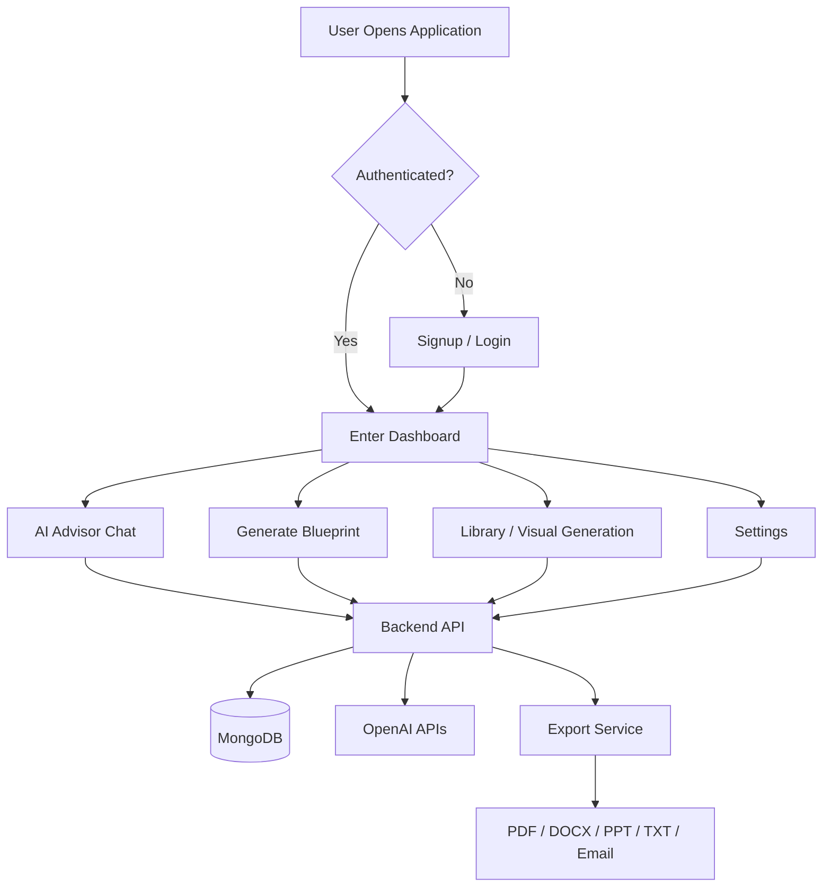
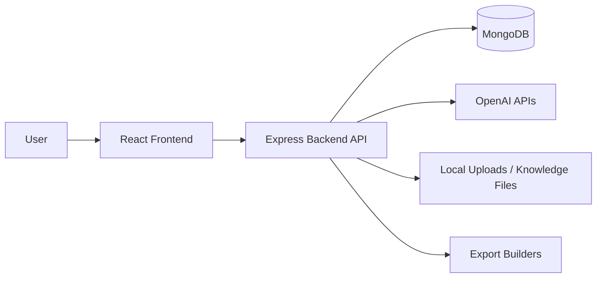
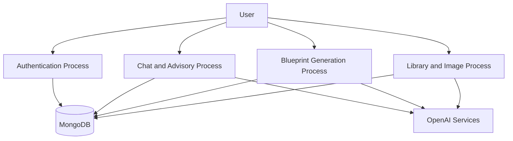
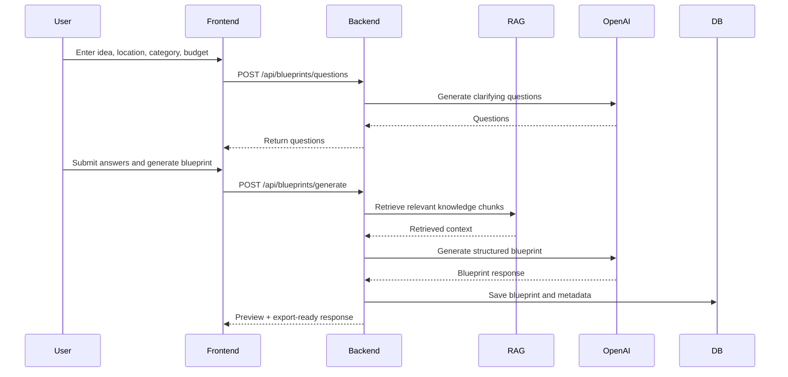
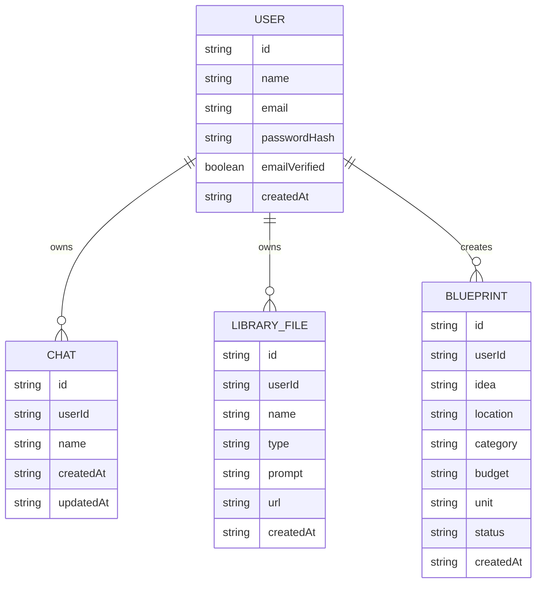

# StartGenie AI Project Report

## Certificate From the Institute

This page is reserved for the institute certificate.

Suggested content to insert here:

- Student name(s)
- Department and institution name
- Project title: **StartGenie AI**
- Academic year / semester
- Guide name and designation
- Head of department signature

## Certificate From Sponsoring Organization

This project currently does not require an external sponsoring organization certificate.

If applicable, replace this section with:

- Sponsor organization name
- Industry mentor details
- Internship/project completion statement
- Authorized signature and seal

## Acknowledgement

We express our sincere gratitude to our project guide, faculty members, and department for their valuable guidance, support, and encouragement during the development of **StartGenie AI**. We also thank our institution for providing the environment and resources required to complete this work successfully.

We extend special thanks to the developers and maintainers of modern open-source technologies such as React, Node.js, Express, MongoDB, Tailwind CSS, and OpenAI APIs, which made it possible to design and implement this intelligent startup-assistance platform.

## Abstract

**StartGenie AI** is a full-stack intelligent web application developed to help students, aspiring founders, and early-stage entrepreneurs transform a raw business idea into a structured startup plan. The system provides AI-assisted chat guidance, startup blueprint generation, document export, authentication, history management, and AI-based business visual generation through a single dashboard-driven interface.

The frontend is built using **React**, **Vite**, and **Tailwind CSS**, while the backend is developed using **Node.js**, **Express.js**, and **MongoDB**. The platform integrates **OpenAI APIs** for conversational support, retrieval-augmented generation, embedding-based knowledge retrieval, and image generation. Users can sign up, log in, chat with an AI advisor, upload files, generate startup diagrams, and export startup blueprints in multiple formats such as PDF, Word, PowerPoint, Text, and Email.

The project addresses the common problem that many students and entrepreneurs have ideas but lack guidance on validation, planning, documentation, and presentation. By combining AI assistance, persistent storage, and exportable results, StartGenie AI provides both academic and practical value.

## Contents

1. [Introduction, Aims, Motivation, and Objectives](#1-introduction-aims-motivation-and-objectives)
2. [Literature Survey](#2-literature-survey)
3. [Problem Statement / Definition](#3-problem-statement--definition)
4. [Software Requirement Specification](#4-software-requirement-specification)
5. [Flowchart](#5-flowchart)
6. [Project Requirement Specification](#6-project-requirement-specification)
7. [Proposed System Architecture](#7-proposed-system-architecture)
8. [High-Level Design of the Project](#8-high-level-design-of-the-project)
9. [System Implementation and Code Documentation](#9-system-implementation-and-code-documentation)
10. [Test Cases](#10-test-cases)
11. [GUI / Working Modules and Experimental Results](#11-gui--working-modules-and-experimental-results)
12. [Project Plan](#12-project-plan)
13. [Analysis and Conclusions With Future Work](#13-analysis-and-conclusions-with-future-work)
14. [Bibliography in IEEE Format](#14-bibliography-in-ieee-format)
15. [Appendices](#appendices)

## List of Abbreviations

| Abbreviation | Expansion |
| --- | --- |
| AI | Artificial Intelligence |
| API | Application Programming Interface |
| JWT | JSON Web Token |
| UI | User Interface |
| UX | User Experience |
| RAG | Retrieval-Augmented Generation |
| SRS | Software Requirement Specification |
| UML | Unified Modeling Language |
| ER | Entity Relationship |
| DB | Database |
| PDF | Portable Document Format |
| PPT | PowerPoint Presentation |

## List of Figures

| Figure No. | Title |
| --- | --- |
| Figure 1 | Overall system flowchart |
| Figure 2 | Proposed system architecture |
| Figure 3 | Data flow overview |
| Figure 4 | UML sequence of blueprint generation |
| Figure 5 | ER diagram of core entities |

## List of Graphs

| Graph No. | Title |
| --- | --- |
| Graph 1 | Feature coverage by module |
| Graph 2 | Expected user workflow completion stages |

## List of Tables

| Table No. | Title |
| --- | --- |
| Table 1 | Functional requirements |
| Table 2 | Non-functional requirements |
| Table 3 | Software and hardware requirements |
| Table 4 | Test cases |
| Table 5 | Project phase plan |

## 1. Introduction, Aims, Motivation, and Objectives

### 1.1 Introduction

StartGenie AI is a startup-assistance platform that helps users convert an idea into an actionable and presentable startup blueprint. The system combines AI chat, idea refinement, retrieval-based knowledge support, diagram generation, and export features in one application. It is designed as a modern web-based tool that can be used by students for academic projects as well as by beginners exploring startup planning.

### 1.2 Aim

The main aim of the project is to build an intelligent assistant that supports users in:

- understanding and refining startup ideas
- generating structured business blueprints
- visualizing startup workflows and concepts
- storing work history for later access
- exporting results in professional formats

### 1.3 Motivation

Many students and first-time founders have startup ideas but struggle with:

- defining the actual problem being solved
- preparing a proper startup plan
- validating business assumptions
- understanding market and operational aspects
- presenting their idea professionally

StartGenie AI was developed to reduce these barriers by offering guided AI-driven support in a single platform.

### 1.4 Objectives

- To provide secure user authentication and profile management.
- To build an AI chat interface for startup guidance.
- To generate structured startup blueprints from simple user inputs.
- To support retrieval-augmented responses using a startup knowledge base.
- To generate AI visuals and diagrams from prompts or uploads.
- To store chats, library files, and blueprints persistently.
- To export startup blueprints as PDF, DOCX, PPT, text, and email.

## 2. Literature Survey

The development of StartGenie AI is influenced by research and technologies in conversational AI, retrieval-augmented generation, modern web applications, and export-oriented information systems.

### 2.1 Existing Approaches

- Traditional startup planning tools are mostly static templates and forms.
- Chatbot systems provide assistance but often lack persistence and structured output generation.
- AI-assisted productivity systems improve ideation but may not support exportable academic or startup-ready deliverables.
- Retrieval-augmented systems improve factual grounding by combining search or knowledge retrieval with language generation.

### 2.2 Findings From Survey

- Conversational systems are more accessible to users than rigid forms.
- RAG improves domain-specific answer quality when supported with knowledge chunks and embeddings.
- Exportable deliverables increase practical usefulness in academic and business settings.
- Secure authentication and persistent storage are necessary for multi-session use.

### 2.3 Relevance to This Project

StartGenie AI combines ideas from:

- AI conversational systems
- knowledge retrieval pipelines
- startup planning frameworks
- full-stack web application design
- document generation systems

This integration makes the project stronger than a standalone chatbot or a simple startup template generator.

## 3. Problem Statement / Definition

People with startup ideas often do not know how to transform those ideas into a structured, realistic, and presentable plan. Existing solutions are usually fragmented across note-taking tools, research websites, diagram tools, presentation software, and chat assistants. This creates inefficiency and inconsistency.

The problem addressed by this project is:

> How can we design a single intelligent system that helps users refine startup ideas, receive contextual AI guidance, generate business blueprints, create related visuals, and export the results in professional formats?

## 4. Software Requirement Specification

### 4.1 Functional Requirements

| ID | Requirement |
| --- | --- |
| FR1 | The system shall allow user signup and login. |
| FR2 | The system shall support Google-based authentication. |
| FR3 | The system shall allow verified users to access protected features. |
| FR4 | The system shall support AI chat for startup guidance. |
| FR5 | The system shall store and retrieve chat history. |
| FR6 | The system shall generate startup blueprints from user inputs. |
| FR7 | The system shall generate clarifying questions before blueprint creation. |
| FR8 | The system shall support AI-based visual generation. |
| FR9 | The system shall store generated files and blueprint records. |
| FR10 | The system shall export blueprints in multiple formats. |

### 4.2 Non-Functional Requirements

| ID | Requirement |
| --- | --- |
| NFR1 | The system should provide a user-friendly interface. |
| NFR2 | The system should respond within reasonable time for standard requests. |
| NFR3 | The system should maintain data security through authentication and hashing. |
| NFR4 | The system should be modular and easy to maintain. |
| NFR5 | The system should support scalability for future enhancements. |

### 4.3 Software Requirements

| Category | Details |
| --- | --- |
| Frontend | React 19, Vite, Tailwind CSS, React Router DOM |
| Backend | Node.js, Express.js |
| Database | MongoDB with Mongoose |
| AI Services | OpenAI Chat, Embeddings, Image Generation |
| Export Libraries | PDFKit, docx, PptxGenJS |
| Authentication | JWT, bcryptjs, Google OAuth |
| Development Tools | ESLint, PostCSS, npm |

### 4.4 Hardware Requirements

| Component | Minimum |
| --- | --- |
| Processor | Intel i3 or equivalent |
| RAM | 4 GB minimum, 8 GB recommended |
| Storage | 1 GB free space or more |
| Internet | Required for API-powered AI features |

## 5. Flowchart

## 6. Project Requirement Specification

### 6.1 User Requirements

- The user should be able to create an account and log in securely.
- The user should be able to chat with the AI advisor.
- The user should be able to generate a business blueprint from a startup idea.
- The user should be able to save and revisit previous chats and outputs.
- The user should be able to export the generated blueprint in required formats.

### 6.2 System Requirements

- The system must provide protected API routes using JWT.
- The system must connect to MongoDB for persistent storage.
- The system must integrate with OpenAI APIs for chat, embeddings, and image generation.
- The system must support file upload and generated image storage.
- The system must generate structured blueprint output suitable for export.

## 7. Proposed System Architecture

The project follows a **client-server architecture** with AI and persistence layers.

### Architecture Description

- The **frontend** manages UI, routing, form submission, and dashboard interactions.
- The **backend** manages authentication, business logic, AI integration, and export generation.
- **MongoDB** stores users, chats, library files, and blueprints.
- **OpenAI APIs** support advisor replies, retrieval embeddings, blueprint creation, and image generation.
- **Local storage and uploads** maintain generated assets and knowledge-base data files.

## 8. High-Level Design of the Project

### 8.1 Data Flow Diagram

### 8.2 UML Sequence Diagram for Blueprint Generation

### 8.3 ER Diagram

## 9. System Implementation and Code Documentation

### 9.1 Frontend Implementation

The frontend is developed using **React** with **Vite**. Route definitions are handled in `src/App.jsx`, and the application contains pages such as landing page, login, signup, AI advisor dashboard, settings, about, contact, blog, and docs.

Important frontend modules:

- `src/App.jsx` for route mapping
- `src/lib/api.js` for API communication and token handling
- `src/pages/AIAdvisor.jsx` for the main dashboard and chat/library/history workflow
- `src/pages/GenerateBlueprint.jsx` for startup blueprint generation flow
- `src/pages/Settings.jsx` for profile and security management

### 9.2 Backend Implementation

The backend is built with **Node.js** and **Express.js**. It exposes REST APIs for authentication, chat, image generation, RAG validation, blueprint creation, and export.

Important backend modules:

- `backend/server.js` for route handling and middleware setup
- `backend/services/mongo.js` for database connection and schemas
- `backend/services/ragService.js` for retrieval logic
- `backend/services/vectorStoreService.js` for embedding index handling
- `backend/services/blueprintService.js` for blueprint and export generation
- `backend/scripts/ingest_client_sources.py` for PDF and web-source ingestion into the RAG knowledge base

### 9.3 Core Methodology

The development follows a modular full-stack approach:

1. User actions are collected through the React frontend.
2. API requests are sent to the Express backend.
3. JWT authentication protects private operations.
4. MongoDB stores user and project data.
5. OpenAI APIs generate AI responses, embeddings, blueprints, and visuals.
6. Export modules convert the generated blueprint into required output formats.

### 9.4 Algorithm-Style Working

#### Algorithm: User Login

1. Accept user email and password.
2. Validate required input.
3. Search user in MongoDB.
4. Compare entered password with stored hash.
5. Generate JWT token on success.
6. Return token and user profile to frontend.

#### Algorithm: AI Advisor Chat

1. Accept user message from dashboard.
2. Validate chat ownership.
3. Store user message in the selected chat.
4. Retrieve relevant knowledge chunks if needed.
5. Generate reply using OpenAI chat completion.
6. Save AI response in chat history.
7. Return updated conversation to frontend.

#### Algorithm: Blueprint Generation

1. Accept idea, location, category, budget, and optional Q and A.
2. Validate required fields.
3. Retrieve relevant startup knowledge through embeddings-based search.
4. Build prompt for structured blueprint generation.
5. Call OpenAI model and obtain structured response.
6. Optionally generate blueprint visual.
7. Save blueprint and visual metadata in MongoDB.
8. Return preview and export-ready result.

## 10. Test Cases

| Test Case ID | Test Scenario | Input | Expected Result | Status |
| --- | --- | --- | --- | --- |
| TC1 | User signup | Name, email, password | Account created successfully | Pass |
| TC2 | User login | Valid credentials | Token issued and dashboard opens | Pass |
| TC3 | Invalid login | Wrong password | Error message shown | Pass |
| TC4 | Create chat message | Startup query | AI response saved in chat | Pass |
| TC5 | Generate blueprint questions | Idea details | Five clarifying questions returned | Pass |
| TC6 | Generate startup blueprint | Valid startup data | Blueprint preview returned | Pass |
| TC7 | Generate AI visual | Prompt text | Image saved to library | Pass |
| TC8 | Export blueprint as PDF | Blueprint ID | PDF file generated | Pass |
| TC9 | Update profile | Modified name/about | User profile updated | Pass |
| TC10 | Delete account | Authenticated request | User data removed | Pass |
| TC11 | Client-source RAG retrieval | Policy/funding query | Relevant client-source chunks returned | Pass |
| TC12 | Blueprint smoke test | Idea + Q&A + export request | Questions, blueprint preview, and text export completed | Pass |

## 11. GUI / Working Modules and Experimental Results

### 11.1 GUI Modules

- Landing page for project introduction
- Login and signup pages
- Email verification and password setup pages
- AI advisor dashboard
- Blueprint generation page/module
- Library page/module for generated visuals
- Settings page for profile and security
- Informational pages such as API, docs, about, blog, and contact

### 11.2 Working Modules

| Module | Description |
| --- | --- |
| Authentication Module | Handles signup, login, Google login, and email verification |
| Chat Module | Supports startup-focused AI conversation and chat history |
| RAG Module | Retrieves knowledge chunks for better AI responses |
| Blueprint Module | Generates structured startup plans from user input |
| Library Module | Stores AI-generated visuals and uploaded-context outputs |
| Export Module | Converts blueprint output into PDF, Word, PPT, text, and email |
| Settings Module | Handles profile updates, password changes, and preferences |

### 11.3 Experimental Results

- The system successfully stores persistent user data using MongoDB.
- Authenticated users can access protected features without exposing private routes.
- The AI advisor provides startup-related conversational guidance.
- Blueprint generation produces structured and reusable business planning content.
- Export functionality increases the usability of the generated blueprint.
- AI-generated visuals improve presentation quality and user understanding.
- The RAG layer now includes structured client-provided PDFs and official/public web sources for policy, scheme, funding, and compliance retrieval.
- The refreshed knowledge base contains 761 client/public chunks tagged for overview, market analysis, business model, SWOT, budget, funding, legal compliance, go-to-market, and roadmap coverage.
- Production build verification and a live smoke test confirmed successful health check, question generation, blueprint generation, and text export.

## 12. Project Plan

| Phase | Activity | Outcome |
| --- | --- | --- |
| Phase 1 | Problem identification and objective definition | Clear project scope |
| Phase 2 | Literature survey and requirement analysis | Requirement list prepared |
| Phase 3 | UI design and architecture planning | Initial design and workflow finalized |
| Phase 4 | Frontend development | User interface and routing completed |
| Phase 5 | Backend development | APIs, authentication, and business logic completed |
| Phase 6 | Database and AI integration | Persistence and AI services connected |
| Phase 7 | Testing and debugging | Functional issues reduced |
| Phase 8 | Documentation and final report preparation | Submission-ready project package |

## 13. Analysis and Conclusions With Future Work

### 13.1 Analysis

The project demonstrates how AI can be integrated into a practical full-stack system for business planning support. It successfully combines modern frontend development, API design, secure authentication, database storage, retrieval-augmented generation, and export workflows. The modular design of StartGenie AI makes it easy to understand, extend, and maintain.

Recent implementation work further strengthened the system by converting client-provided startup policy PDFs and official web references into a structured RAG knowledge base. This improves the factual grounding of blueprint sections such as funding strategy, legal compliance, go-to-market planning, and roadmap design. The project now supports richer India-specific and state-policy-aware blueprint generation for both PDF and PPT exports.

### 13.2 Conclusion

StartGenie AI is a useful and technically relevant project that solves a meaningful real-world problem. It helps users move from an unstructured startup idea to a documented, exportable startup plan with conversational assistance and visual support. The project is academically valuable because it brings together software engineering, web development, database management, and AI integration in one complete system.

### 13.3 Future Work

- Add automated unit and integration tests.
- Support multilingual startup planning assistance.
- Add collaboration and sharing features.
- Improve citation-based retrieval and factual grounding.
- Add analytics dashboard for startup plan quality insights.
- Integrate cloud storage for uploads and generated assets.
- Improve scalability and production deployment readiness.
- Add OCR support for image-only PDF sources that cannot be parsed through standard text extraction.

## 14. Bibliography in IEEE Format

[1] React Team, "React Documentation," React, 2026. [Online]. Available: https://react.dev/

[2] Vite Team, "Vite Documentation," Vite, 2026. [Online]. Available: https://vite.dev/

[3] Express.js, "Express - Node.js Web Application Framework," Express, 2026. [Online]. Available: https://expressjs.com/

[4] MongoDB, "MongoDB Documentation," MongoDB, 2026. [Online]. Available: https://www.mongodb.com/docs/

[5] OpenAI, "OpenAI API Platform Documentation," OpenAI, 2026. [Online]. Available: https://platform.openai.com/docs/

[6] P. Lewis et al., "Retrieval-Augmented Generation for Knowledge-Intensive NLP Tasks," in *Advances in Neural Information Processing Systems*, vol. 33, 2020, pp. 9459-9474.

[7] A. Vaswani et al., "Attention Is All You Need," in *Advances in Neural Information Processing Systems*, 2017, pp. 5998-6008.

[8] Tailwind Labs, "Tailwind CSS Documentation," Tailwind CSS, 2026. [Online]. Available: https://tailwindcss.com/docs/

## Appendices

### Appendix A. Plagiarism Report of Paper and Project Report

Attach plagiarism report generated from an approved plagiarism checking tool.

### Appendix B. Base Paper(s)

Suggested base papers:

- Retrieval-Augmented Generation for Knowledge-Intensive NLP Tasks
- Attention Is All You Need

### Appendix C. Tools Used / Hardware Components Specification

#### Tools Used

- Visual Studio Code
- Node.js and npm
- React and Vite
- Express.js
- MongoDB Atlas / MongoDB
- Postman or browser-based API testing
- Git and GitHub

#### Hardware Components

- Personal computer or laptop
- Internet connection
- Standard keyboard, mouse, and display

### Appendix D. Published Papers and Certificates

Attach the following if available:

- Project paper publication certificate
- Conference or journal acceptance proof
- Internship certificate
- Participation certificates

## Notes for Final Submission

- Replace the certificate sections with scanned and signed institute pages.
- Add actual screenshots of the GUI under the GUI/Results section if required by your college.
- If your guide asks for separate figure numbering, convert the Mermaid diagrams into exported images.
- Add plagiarism report, certificates, and published paper attachments in the appendix before submission.
